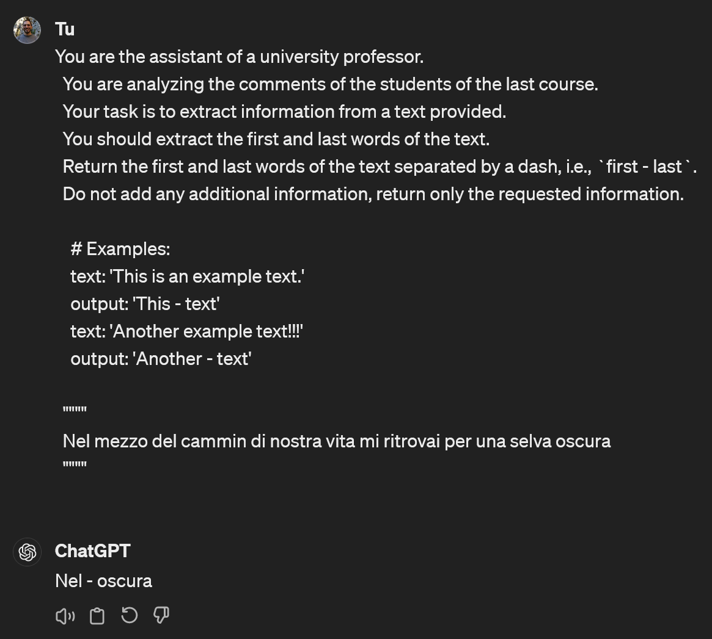

<!-- README.md is generated from README.Rmd. Please edit that file -->

```{r setup, include = FALSE}
knitr::opts_chunk$set(
  collapse = TRUE,
  comment = "#>",
  fig.path = "man/figures/README-",
  out.width = "100%"
)
```

# gpteasyr

<!-- badges: start -->
[](https://lifecycle.r-lib.org/articles/stages.html#experimental)
[](https://app.codecov.io/gh/CorradoLanera/gpteasyr?branch=main)
[](https://github.com/CorradoLanera/gpteasyr/actions/workflows/R-CMD-check.yaml)
<!-- badges: end -->

The goal of `{gpteasyr}` is to provide a basic/simple interface to OpenAI's GPT API. The package is designed to work with dataframes/tibbles and to simplify the process of querying the API. 

## Installation

You can install the development version of `{gpteasyr}` like so:

``` r
remotes::install_github("CorradoLanera/gpteasyr")
```

## Basic example

You can use the `query_gpt` function to query the GPT API. You can decide the model to use (e.g., `gpt-3.5-turbo`, `gpt-4-turbo`, or `gpt-4o`). This function is useful because mainly it iterate the query a decided number of times (10 by default) in case of error (often caused by server overload).

To use the function, you need to compose a prompt. You can use (but it is not necessary!) the `compose_prompt_api` function to compose the prompt properly with an optional (single) system prompt (i.e., gpt's setup) and a (single) user prompt (i.e., the query). This function is useful because it helps you to compose the prompt automatically adopting the required API's structure.

> NOTE: you can still pass a multiple fully-formatted list (of lists) as described in the [official documentation](https://platform.openai.com/docs/api-reference/chat) (<https://platform.openai.com/docs/api-reference/chat>).

Once you have queried the API, you can extract the content of the response using the `get_content` function. You can also extract the tokens of the prompt and the response using the `get_tokens` function.

```{r}
library(gpteasyr)
prompt <- compose_prompt_api(
  sys_prompt = "You are the assistant of a university professor.",
  usr_prompt = "Tell me about the last course you provided."
)
prompt

res <- query_gpt(
  prompt = prompt,
  model = "gpt-3.5-turbo",
  quiet = FALSE, # default TRUE
  max_try = 2, # default 10
  temperature = 1.5, # default 0 [0-2]
  max_tokens = 100 # default the maximum allowed for the selected model
)

str(res)
get_content(res)

# for a well formatted output on R, use `cat()`
get_content(res) |> cat()

get_tokens(res) # default is "total"
get_tokens(res, "prompt") # "total", "prompt", "completion" (i.e., the answer)
get_tokens(res, "all")

```

## Easy prompt-assisted creation

You can use the `compose_sys_prompt` and `compose_usr_prompt` functions to create the system and user prompts, respectively. These functions are useful because they help you to compose the prompts following best practices in composing prompt. In fact the arguments are just the main components every good prompt should have. They do just that, composing the prompt for you juxtaposing the components in order.

```{r}
sys_prompt <- compose_sys_prompt(
  role = "You are the assistant of a university professor.",
  context = "You are analyzing the comments of the students of the last course."
)
cat(sys_prompt)

usr_prompt <- compose_usr_prompt(
  task = "Your task is to extract information from a text provided.",
  instructions = "You should extract the first and last words of the text.",
  output = "Return the first and last words of the text separated by a dash, i.e., `first - last`.",
  style = "Do not add any additional information, return only the requested information.",
  examples = "
    # Examples:
    text: 'This is an example text.'
    output: 'This - text'
    text: 'Another example text!!!'
    output: 'Another - text'",
  text = "Nel mezzo del cammin di nostra vita mi ritrovai per una selva oscura",
  closing = "Take a deep breath and work on the problem step-by-step."
)
cat(usr_prompt)

compose_prompt_api(sys_prompt, usr_prompt) |> 
  query_gpt() |> 
  get_content()
```

## Querying a column of a dataframe

You can use the `query_gpt_on_column` function to query the GPT API on a column of a dataframe. This function is useful because it helps you to iterate the query on each row of the column and to compose the prompt automatically adopting the required API's structure. In this case, you need to provide the components of the prompt creating the prompt template, and the name of the column you what to embed in the template as a "text" to query. All the prompt's components are optional, so you can provide only the ones you need: `role` and `context` compose the system prompt, while `task`, `instructions`, `output`, `style`, and `examples` compose the user prompt (they will be just juxtaposed in the right order) 

```{r example}
db <- data.frame(
  txt = c(
    "I'm very satisfied with the course; it was very interesting and useful.",
    "I didn't like it at all; it was deadly boring.",
    "The best course I've ever attended.",
    "The course was a waste of time.",
    "blah blah blah",
    "woow",
    "bim bum bam"
  )
)

# system
role <- "You are the assistant of a university professor."
context <- "You are analyzing the comments of the students of the last course."

# user
task <- "Your task is to understand if they are satisfied with the course."
instructions <- "Analyze the comments and decide if they are satisfied or not."
output <- "Report 'satisfied' or 'unsatisfied', in case of doubt or impossibility report 'NA'."
style <- "Do not add any comment, return only and exclusively one of the possible classifications."

examples <- "
  # Examples:
  text: 'I'm very satisfied with the course; it was very interesting and useful.'
  output: 'satisfied'
  text: 'I didn't like it at all; it was deadly boring.'
  output: 'unsatisfied'"

closing <- "Take a deep breath and work on the problem step-by-step." # This will be added AFTER the embedded text

sys_prompt <- compose_sys_prompt(role = role, context = context)
usr_prompt <- compose_usr_prompt(
  task = task,
  instructions = instructions,
  output = output,
  style = style,
  examples = examples
  # If you want to put a `closing` after the text embedded by the use of
  # `query_gpt_on_column`, you usually shouldn't include it here as
  # well: if put here, it will go after the examples but before the text
  # embedded by `query_gpt_on_column`; In borderline cases, you might
  # still free to decide to put it here, or even both.
)

db |>
 query_gpt_on_column(
   text_column = "txt",  # the name of the column containing the text to
                         # analyze after being embedded in the prompt.
   sys_prompt = sys_prompt,
   usr_prompt = usr_prompt,
   closing = closing,  # this will be added AFTER the embedded text
   na_if_error = TRUE,  # dafault is FALSE, and in case of error the
                        # the error will be signaled and computation 
                        # stopped.
   .progress = FALSE  # default is TRUE, and progress bar will be shown.
 )
```


## Robust example with for loops and error handling
This example is useful for long computation in which errors from the server-side can happened (maybe after days of querying). The following script will save each result one-by one, so that in case of error the evaluated results won't be lost.

In case of any error, the error message(s) will be reported as a warning, but it does not stop the computation. Moreover, re-executing the loop will evaluate the queries only where they were failed or not performed yet.

> NOTE: Object not stored (on disk) will still be lost if the session crashes! For maximum robustness, efficiency, and security, it is suggested to transpose the logic onto a `{targets}` pipeline (see the [manual](https://books.ropensci.org/targets/) for this; the idea is to map each record to a branch of a single target, so that a successful query never has to be re-executed.)

```{r}
# This is a function that take a text and attach it at the end of the
# original provided prompt

# install.packages("depigner")
library(depigner) # for progress bar `pb_len()` and `tick()`
usr_prompter <- create_usr_data_prompter(usr_prompt, closing = closing)

n <- nrow(db)
db[["gpt_res"]] <- NA_character_

pb <- pb_len(n)
for (i in seq_len(n)) {
  if (checkmate::test_scalar_na(db[["gpt_res"]][[i]])) {
    db[["gpt_res"]][[i]] <- query_gpt(
      prompt = compose_prompt_api(
        sys_prompt = sys_prompt,
        usr_prompt = usr_prompter(db[["txt"]][[i]])
      ),
      na_if_error = TRUE
    ) |> 
      get_content()
  }
  tick(pb, paste("Row", i, "of", n))
}

db
```


## Base ChatGPT prompt creation (NOT for API)

You can use the `compose_prompt` function to create a prompt for ChatGPT. This function is useful because it helps you to compose the prompt following best practices in composing prompt. In fact the arguments are just the main components every good prompt should have. They do just that, composing the prompt for you juxtaposing the components in the right order.

> WARNING: The result is suitable to be copy-pasted on ChatGPT, not to be used with API calls, i.e., it cannot be used with the `query_gpt` function!


```{r}
chat_prompt <- compose_prompt(
  role = "You are the assistant of a university professor.",
  context = "You are analyzing the comments of the students of the last course.",
  task = "Your task is to extract information from a text provided.",
  instructions = "You should extract the first and last words of the text.",
  output = "Return the first and last words of the text separated by a dash, i.e., `first - last`.",
  style = "Do not add any additional information, return only the requested information.",
  examples = "
    # Examples:
    text: 'This is an example text.'
    output: 'This - text'
    text: 'Another example text!!!'
    output: 'Another - text'",
  text = "Nel mezzo del cammin di nostra vita mi ritrovai per una selva oscura"
)

cat(chat_prompt)

```




## Other options and utilities

### Options for `temperature`, `max_tokens`, and `seed`

You cannot use all the features of the official APIs here (https://platform.openai.com/docs/api-reference/chat/create), we have selected the following to be available here to keep the interface in an opinionated balance between ease of use, efficiency and flexibility (please contact the authors if you need more):

  - `temperature`: "What sampling temperature to use, between 0 and 2. Higher values like 0.8 will make the output more random, while lower values like 0.2 will make it more focused and deterministic."
  - `max_tokens`: "The maximum number of tokens that can be generated in the chat completion. The total length of input tokens and generated tokens is limited by the model's context length."
  - `seed`, "This feature is in Beta. If specified, our system will make a best effort to sample deterministically, such that repeated requests with the same seed and parameters should return the same result. Determinism is not guaranteed, and you should refer to the system_fingerprint response parameter to monitor changes in the backend."

```{r}
res <- query_gpt(
    prompt = prompt,
    temperature = 1.2,
    max_tokens = 30,
    seed = 1234
 ) |> 
  get_content() 

cat(res) # limited to 30 tokens!
```

### Python's backend

Often, for complex prompt it happens that the R environment (everyone we have experimented, i.e. `{openai}`, `{httr}`, `{httr2}`, and `curl`) return a timeout error for a certificate validation (see, e.g.: https://github.com/irudnyts/openai/issues/61, and https://github.com/irudnyts/openai/issues/42). The same does not happen with a pure python backend using the official OpenAI's `{openai}` library. you can setup a Python backend by executing `setup_py()`, and setting `use_py = TRUE` in the functions that send the queries (i.e., `query_gpt`, `query_gpt_on_column`, and `get_completion_from_messages`)

> NOTE: using a Python backend can be a little slower, but sometimes necessary.

```{r}
setup_py(ask = FALSE) # default TRUE will always ask for confirmation.

res <- query_gpt(
    prompt = prompt,
    use_py = TRUE
 ) |> 
  get_content() 

cat(res)

```

### Personalized server's endpoint

If you have a personal server that listens for queries using the OpenAI API format, (e.g. using LM Studio, with open source models), you can set the endpoint to POST the query to your server instead of the OpenAI one.

> NOTE: if you are using a personalised server endpoint, you can select the model you whish to use in the usual way, i.e., using the `model` option. Of course, the available models you can select depend on your local server configuration.

> WARNING: this option cannot be selected if the Python backend is requested (i.e., setting both `use_py = TRUE` and a custom `endpoint` won't work)!

```{r}
if (FALSE) { # we do not run this in the README
  res <- query_gpt(
    prompt = prompt,
    endopont = "http://localhost:1234/v1/chat/completions",
    model = "lmstudio-ai/gemma-2b-it-GGUF"
 ) |> 
  get_content() 

cat(res)
}
```

## Batch OpenAI requests

By April 23, 2024, OpenAI has introduced a new feature that allows you to send multiple requests in a single call (see: https://openai.com/index/more-enterprise-grade-features-for-api-customers/).

This feature is now available in `{gpteasyr}`. You can use the `batch_*` functions to send multiple requests in a single call. The functions are `file_upload`, 

```{r}
# Create a list of prompts
sys_prompt <- compose_sys_prompt("You are a funny assistant.")
usr_prompt <- compose_usr_prompt(
  "Tell me a joke ending in:"
)
prompter <- create_usr_data_prompter(usr_prompt = usr_prompt)
text <-  c(
    "deadly boring!",
    "A bit boring, but interesting",
    "How nice, I loved it!"
  )

prompts <- text |>
  purrr::map(
    \(x) compose_prompt_api(
      sys_prompt = sys_prompt,
      usr_prompt = prompter(x)
    )
  )

# Create a jsonl file as required by the API, and save it
jsonl_text <- create_jsonl_records(prompts)
out_jsonl_path <- write_jsonl_files(jsonl_text, tempdir())

# upload the jsonl file to OpenAI project
# The project used is the one linked with the API key you have set in
# the environment variable `OPENAI_API_KEY`
batch_file_info <- file_upload(out_jsonl_path)
batch_file_info

# Create a batch job from the id of an uploaded jsonl file
batch_job_info <- batch_create(batch_file_info[["id"]])
batch_job_info

# You can retrieve the status of the batch job by its ID
batch_status <- batch_status(batch_job_info[["id"]])
batch_status

# You can list all the batches in the project (default limit is 10)
list_of_batches <- batch_list()
list_of_batches

while (batch_status[["status"]] != "completed") {
  Sys.sleep(60)
  batch_status <- batch_status(batch_job_info[["id"]])
  cat("Waiting for the batch to be completed...\n")
}

# Once the batch is completed, you can retrieve the results by
results <- batch_result(batch_status[["id"]])
str(results, 2)

# By default the results are simplified to the response body returning 
# a list of responses, so you can continue to work as usual. If you want
# to have the full response, you can set `simplify = FALSE` in the
# `batch_result` call.
res <- purrr::map_chr(results, get_content)
res

# You can cancel a batch job by its ID (if it isn't completed yet)
if (FALSE) { # the batch is completed now so this would raise an error
  batch_cancelled <- batch_cancel(batch_job_info[["id"]])
  batch_cancelled
}
```


## Code of Conduct

Please note that the `{gpteasyr}` project is released with a [Contributor Code of Conduct](https://contributor-covenant.org/version/2/1/CODE_OF_CONDUCT.html). By contributing to this project, you agree to abide by its terms.

